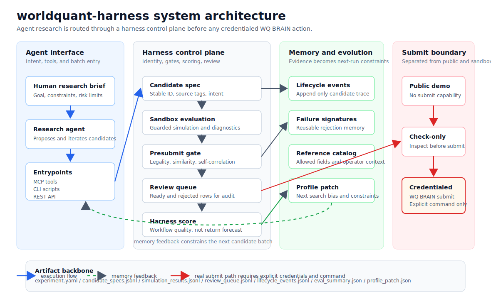

<div align="center">

# worldquant-harness

**A harness-based framework for WorldQuant-style alpha research agents.**

Agent generates candidates -> harness records, gates, evaluates, remembers, and evolves -> human explicitly selects what can reach real submission.

[](https://github.com/gyx09212214-prog/worldquant-harness/actions/workflows/ci.yml)
[](https://python.org)
[](https://fastapi.tiangolo.com)
[](https://react.dev)
[](LICENSE)

[中文说明](README.zh-CN.md) ·
[Quick Start](docs/QUICKSTART.md) ·
[Visual Guide](docs/VISUAL_GUIDE.md) ·
[Public Demo](docs/PUBLIC_HARNESS_DEMO.md) ·
[Alpha-GPT Harness](docs/ALPHA_GPT_HARNESS.md) ·
[Harness Contract](docs/AGENT_HARNESS_CONTRACT.md) ·
[Agent Roles](docs/AGENT_ROLES.md) ·
[Architecture](docs/ARCHITECTURE.md) ·
[API](docs/API_DOC.md) ·
[MCP](docs/MCP_GUIDE.md) ·
[WQ Workflow](docs/WQ_WORKFLOW.md) ·
[Safety](docs/SECURITY_AND_LIMITATIONS.md)


</div>

---

## What It Is

worldquant-harness is not a one-shot alpha generator. It is an explicit-submit, memory-driven Alpha-GPT-style research harness for WorldQuant-oriented alpha workflows.

The agent can propose hypotheses, candidate specs, batches, and reviews. The harness owns the lifecycle: candidate identity, sandbox execution, no-submit gates, review queues, rejection reasons, historical memory, profile evolution, and the explicit boundary before any real WQ BRAIN action.

This project is not affiliated with or endorsed by WorldQuant or WorldQuant BRAIN. Review [Disclaimer](DISCLAIMER.md), [Security](SECURITY.md), and [Responsible Use](docs/SECURITY_AND_LIMITATIONS.md) before connecting credentials or publishing artifacts.

## Why Harness

Most AI quant workflows stop at idea -> expression -> backtest. That leaves the hard parts outside the system: traceability, rejection memory, duplicate control, platform boundary control, and reproducible review.

worldquant-harness treats factor mining as a controlled research loop:

| Problem | Harness response |
|:--|:--|
| Candidate batches become hard to audit | Every candidate gets a stable ID and lifecycle artifacts |
| Failed ideas are repeated | Failures become structured memory and next-round constraints |
| Submission boundaries become ambiguous | Public demo, sandbox, presubmit, check-only, and real submit are separated |
| Agent context is fragile | Notes, events, review queues, and profile patches are persisted |
| Public releases can leak private work | Demo artifacts and visual packs are synthetic or sanitized |

## Architecture

<p align="center">
  
</p>

| Layer | Responsibility |
|:--|:--|
| Agent interface | Turns a research brief into candidate batches through MCP tools, CLI scripts, or REST calls |
| Harness control plane | Assigns stable candidate identity, runs sandbox evaluation, applies presubmit gates, and builds a review queue |
| Memory and evolution | Converts lifecycle events, rejection reasons, reference context, and harness scores into next-run constraints |
| Submit boundary | Keeps public demo and sandbox paths no-submit by default; real WQ BRAIN submission requires credentials and an explicit command |

The default public path does not submit anything. Real WQ BRAIN actions require explicit credentials and explicit submission commands.

## Public Demo

The public demo is the reproducible contract. It uses synthetic fixtures and guarded adapters, so it does not require WQ BRAIN, DeepSeek, Wind, or private market data.

```bash
git clone https://github.com/gyx09212214-prog/worldquant-harness.git
cd worldquant-harness
pip install -e ".[dev]"
python scripts/run_public_harness_demo.py --output-root reports/public_harness_demo
python scripts/validate_public_harness_artifacts.py reports/public_harness_demo
python scripts/run_public_harness_eval.py --output-root reports/public_harness_eval
```

The demo writes a complete no-submit research bundle:

| Artifact | Purpose |
|:--|:--|
| `candidate_specs.jsonl` | Candidate source, tags, and design intent |
| `hypotheses.jsonl` | Alpha-GPT-style research hypothesis |
| `alpha_gpt_candidate_specs.jsonl` | Candidate specs linked to placeholder templates, bindings, constraints, and hypothesis |
| `simulation_results.jsonl` | Guarded adapter outcomes |
| `review_queue.jsonl` | Candidates queued for gate review |
| `review_decisions.jsonl` | Promote/retry/reject decisions for the Alpha-GPT loop |
| `presubmit_ready_sequential.jsonl` | Accepted candidates |
| `presubmit_rejected.jsonl` | Rejection reasons and blocker memory |
| `alpha_lifecycle_events.jsonl` | Append-only lifecycle trace |
| `submit_evidence.json` | Explicit-submit boundary evidence; public eval records no real submit attempt |
| `eval_summary.json` | Harness score and gate decision |
| `evolution_result.json` | Next-generation profile candidate |

## Alpha-GPT Dry Run

The smallest no-submit Alpha-GPT loop does not need WQ BRAIN credentials:

```bash
python scripts/wq_alpha_gpt_workflow.py demo --topic "analyst revision momentum"
```

It writes hypothesis, placeholder template, candidate spec, local validation,
review queue, reflection memory, profile patch, and submit-evidence artifacts
under `reports/examples/alpha_gpt_demo/`.

## Visual Pack

The visual pack is generated from public-safe artifacts. It is meant to explain the harness rather than disclose private research.

| View | What it shows |
|:--|:--|
| [Overview](docs/images/worldquant-harness-overview.svg) | Human goal -> agent -> harness -> memory -> review |
| [Architecture](docs/images/worldquant-harness-architecture.svg) | Agent interface, harness control plane, memory feedback, and submit boundary |
| [Artifact lifecycle](docs/images/harness-artifact-lifecycle.svg) | Candidate specs, simulations, review queues, and memory |
| [Public demo trace](docs/images/public-demo-trace.svg) | Candidate movement through ready and rejected states |
| [Memory feedback](docs/images/memory-feedback-graph.svg) | How blockers become future constraints |
| [Quality dashboard](docs/images/quality-review-dashboard.svg) | Submitted and generated quality review |
| [Submit boundary](docs/images/submit-boundary.svg) | No-submit, check-only, and real submit separation |
| [Strategy display](docs/images/strategy-display-alpha-set.svg) | Selected active validation metrics without alpha expressions |
| [Release boundary](docs/images/release-safety-boundary.svg) | Public, private, and review-required artifacts |

## Strategy Display Validation

The public demo proves the harness contract. The examples below are selected active validation records for strategy display. They are included to show that harness-controlled research can reach submit-quality candidates. Exact alpha expressions and platform code panels are intentionally omitted.

<p align="center">
  
</p>

| Alpha ID | Status | WQ Sharpe | WQ Fitness | WQ Returns | Turnover | Drawdown | Neutralization |
|:--|:--:|:--:|:--:|:--:|:--:|:--:|:--:|
| `3qz93wP6` | ACTIVE | **2.38** | 1.60 | **18.94%** | 41.79% | 6.49% | MARKET |
| `3q7Rew3e` | ACTIVE | 2.08 | 1.68 | 10.32% | 15.87% | 4.47% | SUBINDUSTRY |
| `YPN9QR0M` | ACTIVE | 2.06 | 1.72 | 8.70% | 10.93% | 3.36% | SUBINDUSTRY |
| `akd1QGp1` | ACTIVE | 1.81 | **1.78** | 12.08% | 11.87% | 5.93% | INDUSTRY |

<p align="center">
  <sub>Historical validation metrics. Alpha expressions are not published.</sub>
</p>

Past factor performance does not guarantee future returns. These validation records are not required to run the open-source demo and do not constitute investment advice.

## Agent Contract

The agent can explore, but it works inside a contract. The harness owns state and creates reviewable artifacts.

| Agent action | Harness control |
|:--|:--|
| Generate candidates | Stable candidate IDs, source tags, field and operator extraction |
| Run experiments | Sandbox artifacts and no-submit defaults |
| Interpret results | Structured review queue and rejection reasons |
| Learn from failures | Memory records, blocked signatures, field-family stats |
| Plan the next batch | Profile evolution and explicit child experiment |
| Submit | Human-selected alpha IDs only |

The executable contract is implemented through `HarnessRun`, `HarnessStep`, `HarnessEvent`, `ArtifactRef`, `DecisionGate`, `MemoryDelta`, `ProfilePatch`, and the Alpha-GPT semantic records for hypothesis, candidate spec, review decision, reflection, and submit evidence. See [Agent Harness Contract](docs/AGENT_HARNESS_CONTRACT.md), [Alpha-GPT Harness](docs/ALPHA_GPT_HARNESS.md), and [Agent Roles](docs/AGENT_ROLES.md).

## Core Capabilities

| Area | Capability |
|:--|:--|
| Harness orchestration | Public no-submit eval, sandbox experiments, presubmit gates, lifecycle traces |
| Memory | History ingest, blocker signatures, factor-family stats, profile evolution |
| Agent access | MCP tools, CLI scripts, REST API, monitoring UI |
| Review | Quality review dashboards, submit efficiency reports, ready/rejected queues |
| WQ boundary | Check-only inspection and explicit credentialed submission commands |
| Local research | Local parser, backtest, anti-overfit checks, walk-forward validation |

<details>
<summary><b>MCP tool surface</b></summary>

The MCP server exposes harness and research operations for agent workflows, including public harness runs, presubmit evaluation, history ingestion, memory maintenance, status inspection, local backtesting, factor scoring, diagnostics, anti-overfit checks, rolling validation, and explicit WQ BRAIN check/submit commands.

</details>

## Setup

Start the HTTP server:

```bash
python -m worldquant_harness --transport http
```

Use MCP from Claude Code or Claude Desktop:

```json
{
  "mcpServers": {
    "worldquant-harness": {
      "command": "python",
      "args": ["-m", "worldquant_harness"]
    }
  }
}
```

For the full local setup, Windows notes, optional PostgreSQL, optional DeepSeek configuration, and API examples, use [Quick Start](docs/QUICKSTART.md).

## Project Layout

```text
worldquant-harness/
├── worldquant_harness/          # Backend, parser, harness contracts, MCP, API
├── frontend/                    # React monitoring dashboard
├── scripts/                     # Public demo, visual pack, review, WQ workflows
├── tests/                       # Parser, backtest, workflow, API, harness tests
├── example_factor/              # Sanitized historical validation screenshots
└── docs/                        # Architecture, API, MCP, workflow, safety docs
```

## Responsible Use

- Use your own credentials for external services and follow their terms, policies, rate limits, and data restrictions.
- Keep `.env`, `.secrets/`, local databases, raw platform exports, submit/check ledgers, and full research reports private.
- Do not publish alpha expressions, private platform exports, or unsanitized screenshots without review.
- Do not present generated factors, screenshots, or backtests as guaranteed returns.
- Review [Open Source Audit](docs/OPEN_SOURCE_AUDIT.md) and [Release Checklist](docs/OPEN_SOURCE_RELEASE_CHECKLIST.md) before publishing a fork or release.

## License

[MIT](LICENSE). Copyright and attribution details are recorded in [NOTICE](NOTICE).

This public release is maintained as `worldquant-harness`. Derivative works should retain the copyright notice and comply with the MIT License terms.

See [NOTICE](NOTICE), [DISCLAIMER](DISCLAIMER.md), [SECURITY](SECURITY.md), and [CODE_OF_CONDUCT](CODE_OF_CONDUCT.md) for details.
