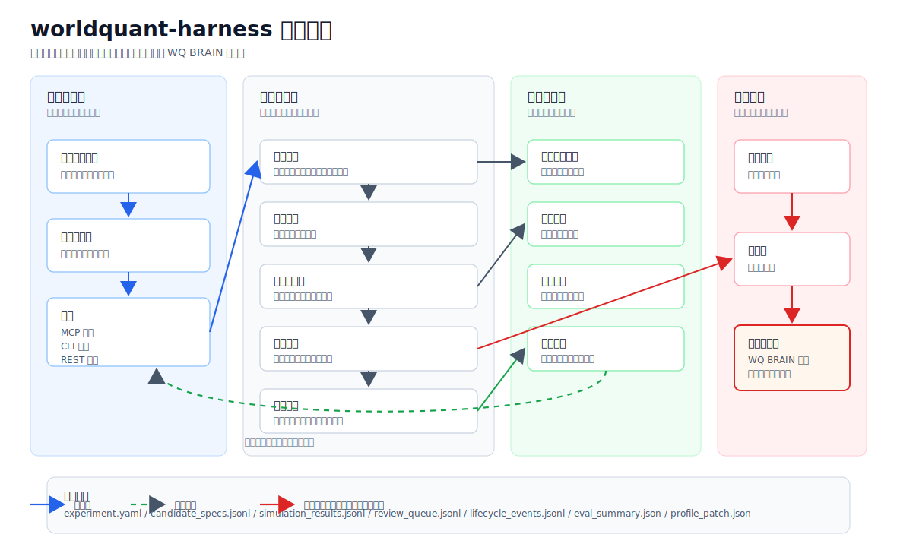
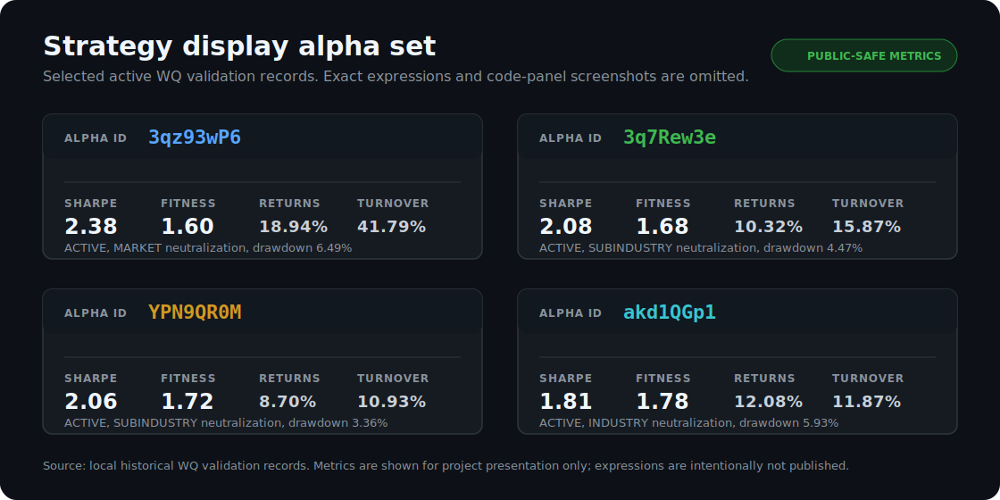

<div align="center">

# worldquant-harness

**面向 WorldQuant 风格 alpha 研究智能体的约束框架。**

智能体生成候选 -> 框架记录、门控、评估、记忆、演化 -> 人工显式选择可提交对象。

[](https://github.com/gyx09212214-prog/worldquant-harness/actions/workflows/ci.yml)
[](https://python.org)
[](https://fastapi.tiangolo.com)
[](https://react.dev)
[](LICENSE)

[英文版](README.md) ·
[快速开始](docs/QUICKSTART.md) ·
[可视化指南](docs/VISUAL_GUIDE.md) ·
[公开演示](docs/PUBLIC_HARNESS_DEMO.md) ·
[研究契约](docs/AGENT_HARNESS_CONTRACT.md) ·
[智能体角色](docs/AGENT_ROLES.md) ·
[架构](docs/ARCHITECTURE.md) ·
[接口](docs/API_DOC.md) ·
[MCP 指南](docs/MCP_GUIDE.md) ·
[WQ 工作流](docs/WQ_WORKFLOW.md) ·
[安全说明](docs/SECURITY_AND_LIMITATIONS.md)


</div>

---

## 项目定位

worldquant-harness 不是一次性 alpha 生成器。它是智能体因子研究的执行层和记忆层。

智能体可以提出想法、运行批量实验、查看结果。框架负责生命周期：候选标识、沙盒执行、无提交门控、复盘队列、拒绝原因、历史记忆、画像演化、真实 WQ BRAIN 操作前的显式边界。

本项目不隶属于 WorldQuant 或 WorldQuant BRAIN，也未获其背书。接入凭证或发布产物前，请先阅读 [免责声明](DISCLAIMER.md)、[安全政策](SECURITY.md)、[使用边界](docs/SECURITY_AND_LIMITATIONS.md)。

## 为什么需要约束框架

很多 AI 量化流程停在想法 -> 表达式 -> 回测。真正困难的部分常被留在系统外：可追踪性、失败记忆、重复控制、平台边界、可复现复盘。

worldquant-harness 把因子挖掘视为受控研究循环：

| 问题 | 处理方式 |
|:--|:--|
| 批量候选难以审计 | 每个候选有稳定 ID 和生命周期产物 |
| 失败想法反复出现 | 失败进入结构化记忆和下一轮约束 |
| 提交边界不清晰 | 公开演示、沙盒、预提交、只检查、真实提交分离 |
| 智能体上下文易丢失 | 笔记、事件、复盘队列、画像补丁持久化 |
| 开源发布可能泄露私有研究 | 演示产物和视觉材料使用合成或脱敏内容 |

## 架构

<p align="center">
  
</p>

| 层级 | 职责 |
|:--|:--|
| 智能体入口 | 将研究目标转成候选批次，可通过 MCP 工具、CLI 脚本、REST 接口进入 |
| 框架控制面 | 分配稳定候选标识，运行沙盒评估，执行预提交门控，生成复盘队列 |
| 记忆与演化 | 将生命周期事件、拒绝原因、参考上下文、框架评分转成下一轮约束 |
| 提交边界 | 公开演示和沙盒默认不提交；真实 WQ BRAIN 提交需要凭证和显式命令 |

默认公开路径不会提交。真实 WQ BRAIN 操作需要显式凭证和显式提交命令。

## 公开演示

公开演示是可复现契约。它使用合成测试夹具和受保护适配器，不需要 WQ BRAIN、DeepSeek、Wind 或私有行情数据。

```bash
git clone https://github.com/gyx09212214-prog/worldquant-harness.git
cd worldquant-harness
pip install -e ".[dev]"
python scripts/run_public_harness_demo.py --output-root reports/public_harness_demo
python scripts/validate_public_harness_artifacts.py reports/public_harness_demo
python scripts/run_public_harness_eval.py --output-root reports/public_harness_eval
```

演示会写出完整的无提交研究包：

| 产物 | 用途 |
|:--|:--|
| `candidate_specs.jsonl` | 候选来源、标签、设计意图 |
| `simulation_results.jsonl` | 受保护适配器的结果 |
| `review_queue.jsonl` | 等待门控复盘的候选 |
| `presubmit_ready_sequential.jsonl` | 通过的候选 |
| `presubmit_rejected.jsonl` | 拒绝原因和阻塞记忆 |
| `alpha_lifecycle_events.jsonl` | 追加式生命周期轨迹 |
| `eval_summary.json` | 框架评分和门控决策 |
| `evolution_result.json` | 下一轮画像候选 |

## 可视化材料

可视化材料来自公开安全产物。它用于解释约束框架，不披露私有研究。

| 视图 | 内容 |
|:--|:--|
| [概览](docs/images/worldquant-harness-overview.svg) | 人工目标 -> 智能体 -> 约束框架 -> 记忆 -> 复盘 |
| [架构](docs/images/worldquant-harness-architecture.zh-CN.svg) | 智能体入口、框架控制面、记忆反馈、提交边界 |
| [产物生命周期](docs/images/harness-artifact-lifecycle.svg) | 候选规格、模拟结果、复盘队列、记忆 |
| [公开演示轨迹](docs/images/public-demo-trace.svg) | 候选在就绪和拒绝状态间流转 |
| [记忆反馈](docs/images/memory-feedback-graph.svg) | 阻塞项如何变成下一轮约束 |
| [质量面板](docs/images/quality-review-dashboard.svg) | 已提交和已生成 alpha 的质量复盘 |
| [提交边界](docs/images/submit-boundary.svg) | 无提交、只检查、真实提交的分离 |
| [策略展示](docs/images/strategy-display-alpha-set.svg) | 已选 ACTIVE 验证指标，不公开 alpha 表达式 |
| [发布边界](docs/images/release-safety-boundary.svg) | 公开、私有、需复核产物 |

## 策略展示验证

公开演示证明框架契约。下面是用于策略展示的已选 ACTIVE 验证记录。它们说明受控研究可以产出可提交候选。精确 alpha 表达式和平台代码面板不公开。

<p align="center">
  
</p>

| Alpha 标识 | 状态 | WQ 夏普 | WQ 适应度 | WQ 收益 | 换手率 | 回撤 | 中性化 |
|:--|:--:|:--:|:--:|:--:|:--:|:--:|:--:|
| `3qz93wP6` | ACTIVE | **2.38** | 1.60 | **18.94%** | 41.79% | 6.49% | MARKET |
| `3q7Rew3e` | ACTIVE | 2.08 | 1.68 | 10.32% | 15.87% | 4.47% | SUBINDUSTRY |
| `YPN9QR0M` | ACTIVE | 2.06 | 1.72 | 8.70% | 10.93% | 3.36% | SUBINDUSTRY |
| `akd1QGp1` | ACTIVE | 1.81 | **1.78** | 12.08% | 11.87% | 5.93% | INDUSTRY |

<p align="center">
  <sub>历史验证指标。Alpha 表达式不公开。</sub>
</p>

历史表现不代表未来收益。这些验证记录不是运行开源演示的必要条件，也不构成投资建议。

## 智能体契约

智能体可以探索，但必须在契约内工作。框架管理状态，生成可复盘产物。

| 智能体动作 | 框架控制 |
|:--|:--|
| 生成候选 | 稳定候选 ID、来源标签、字段和算子提取 |
| 运行实验 | 沙盒产物，无提交默认值 |
| 解读结果 | 结构化复盘队列和拒绝原因 |
| 从失败中学习 | 记忆记录、阻塞签名、字段族统计 |
| 规划下一批 | 画像演化和显式子实验 |
| 提交 | 只允许人工选定 alpha ID |

可执行契约由 `HarnessRun`、`HarnessStep`、`HarnessEvent`、`ArtifactRef`、`DecisionGate`、`MemoryDelta`、`ProfilePatch` 表达。见 [研究契约](docs/AGENT_HARNESS_CONTRACT.md) 和 [智能体角色](docs/AGENT_ROLES.md)。

## 核心能力

| 模块 | 能力 |
|:--|:--|
| 编排 | 公开无提交评估、沙盒实验、预提交门控、生命周期轨迹 |
| 记忆 | 历史导入、阻塞签名、字段族统计、画像演化 |
| 智能体接入 | MCP 工具、CLI 脚本、REST API、监控 UI |
| 复盘 | 质量复盘面板、提交效率报告、就绪/拒绝队列 |
| WQ 边界 | 只检查、显式凭证化提交命令 |
| 本地研究 | 本地解析器、回测、反过拟合检查、滚动验证 |

<details>
<summary><b>MCP 工具面</b></summary>

MCP 服务向智能体工作流暴露约束框架和研究操作，包括公开运行、预提交评估、历史导入、记忆维护、状态读取、本地回测、因子评分、诊断、反过拟合检查、滚动验证、显式 WQ BRAIN 检查和提交命令。

</details>

## 安装与启动

启动 HTTP 服务：

```bash
python -m worldquant_harness --transport http
```

在 Claude Code 或 Claude Desktop 中使用 MCP：

```json
{
  "mcpServers": {
    "worldquant-harness": {
      "command": "python",
      "args": ["-m", "worldquant_harness"]
    }
  }
}
```

完整本地安装、Windows 说明、可选 PostgreSQL、可选 DeepSeek 配置、API 示例见 [快速开始](docs/QUICKSTART.md)。

## 项目结构

```text
worldquant-harness/
├── worldquant_harness/          # 后端、解析器、研究契约、MCP、API
├── frontend/                    # React 监控面板
├── scripts/                     # 公开演示、视觉材料、复盘、WQ 工作流
├── tests/                       # 解析器、回测、工作流、API、框架测试
├── example_factor/              # 脱敏历史验证截图
└── docs/                        # 架构、接口、MCP、工作流、安全文档
```

## 负责任使用

- 使用自己的外部服务凭证，遵守服务条款、政策、频率限制、数据限制。
- 保护 `.env`、`.secrets/`、本地数据库、原始平台导出、提交/检查台账、完整研究报告。
- 不发布 alpha 表达式、私有平台导出、未脱敏截图。
- 不把生成因子、截图、回测结果表述为确定收益。
- 发布分支或版本前，阅读 [开源审计](docs/OPEN_SOURCE_AUDIT.md) 和 [发布清单](docs/OPEN_SOURCE_RELEASE_CHECKLIST.md)。

## 许可证

[MIT](LICENSE)。版权和归因记录见 [NOTICE](NOTICE)。

本公开版本以 `worldquant-harness` 维护。衍生作品应保留版权声明，遵守 MIT 许可证条款。

更多信息见 [NOTICE](NOTICE)、[免责声明](DISCLAIMER.md)、[安全政策](SECURITY.md)、[行为准则](CODE_OF_CONDUCT.md)。
