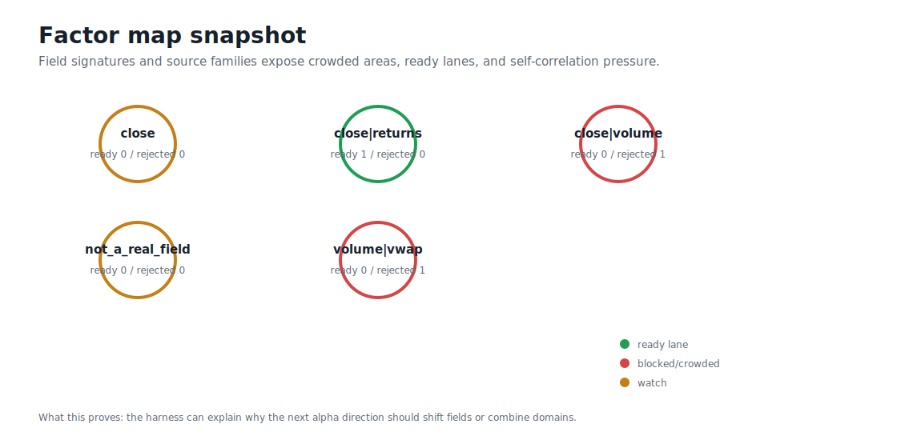
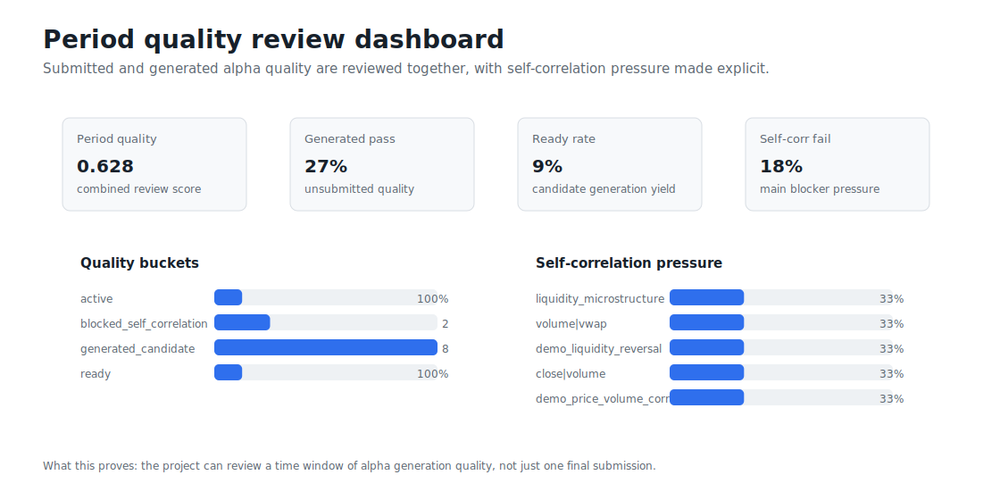
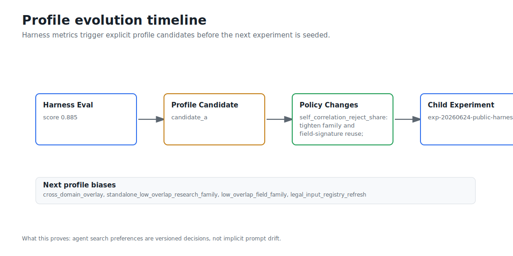

# worldquant-harness Visual Guide

This guide is generated from public harness demo artifacts. It is designed as the fastest path for a new reader to understand worldquant-harness as an agent research harness with memory feedback.

## Start Here


What this proves: worldquant-harness is a reproducible loop around agent research, presubmit gates, memory, quality review, and profile evolution.

## Artifact Lifecycle


What this proves: every agent decision is persisted as an auditable artifact before any submit-capable command can be used.

## Public Demo Trace


The demo funnel is candidates 5 -> simulated 3 -> ready 1 -> submitted 0. The stable `candidate_uid` links lifecycle events across artifacts.

## Memory Feedback


What this proves: failures and blockers are converted into structured memory instead of being lost in logs.

## Factor Map



What this proves: field signatures, source families, and self-correlation pressure make the next synthesis direction explainable.

## Quality Review



What this proves: a time window of generated and submitted alpha quality can be reviewed before changing the research profile.

## Profile Evolution



What this proves: the next agent profile is a tracked artifact derived from harness metrics.

## Submit Boundary


What this proves: public demo, sandbox, and presubmit paths are no-submit by default; real submission requires explicit commands and user credentials.

## Release Boundary


What this proves: the public repository should publish the harness and synthetic demo while keeping credentials, raw platform exports, and private research ledgers out of Git.

## Reproduce

```powershell
python scripts/run_public_harness_demo.py --output-root reports/public_harness_demo
python scripts/validate_public_harness_artifacts.py reports/public_harness_demo
python scripts/wq_submit_efficiency_report.py `
  --run-roots reports/public_harness_demo `
  --current-name public-demo `
  --output reports/public_harness_demo/efficiency_summary.json `
  --markdown-output reports/public_harness_demo/efficiency_summary.md `
  --events-output reports/public_harness_demo/efficiency_events.jsonl
python scripts/wq_alpha_quality_review.py `
  --reports reports/public_harness_demo `
  --no-platform `
  --no-profile-candidate `
  --output-dir reports/public_harness_demo/quality_review
python scripts/build_public_visual_pack.py --source reports/public_harness_demo --output-dir docs/images --report docs/VISUAL_GUIDE.md
```

## Artifact To Visual Map

| Artifact | Visual use |
| --- | --- |
| `demo_summary.json` | overview, submit guard, experiment identity |
| `candidate_specs.jsonl` | candidate count, field map, lifecycle start |
| `presubmit_run/presubmit_ready_sequential.jsonl` | ready lane and accepted candidates |
| `presubmit_run/presubmit_rejected.jsonl` | rejection reasons and blocker memory |
| `evaluations/<eval-id>/eval_summary.json` | harness score, reject counts, field signatures |
| `evaluations/<eval-id>/evolution_result.json` | profile candidate and next experiment |
| `efficiency_summary.json` | candidate_uid funnel and source-family leaderboards |
| `quality_review/summary.json` | period quality dashboard and self-correlation pressure |
| `quality_review/recommended_directions.json` | next synthesis direction callouts |
| `SECURITY.md`, `.gitignore`, release checklist | submit boundary and release boundary |

## Current Artifact Availability

| Artifact | Status |
| --- | --- |
| `candidate_specs` | available |
| `demo_summary` | available |
| `efficiency_summary` | available |
| `eval_summary` | available |
| `evolution_result` | available |
| `quality_summary` | available |
| `ready` | available |
| `recommended_directions` | available |
| `rejected` | available |

The generated visuals intentionally avoid absolute local paths and private credential material.
