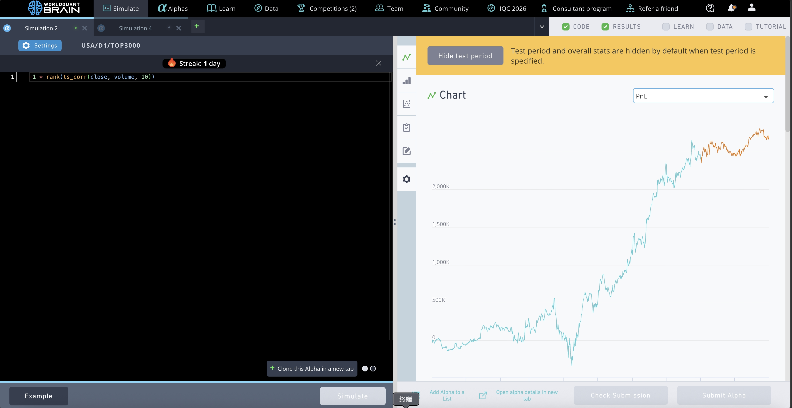
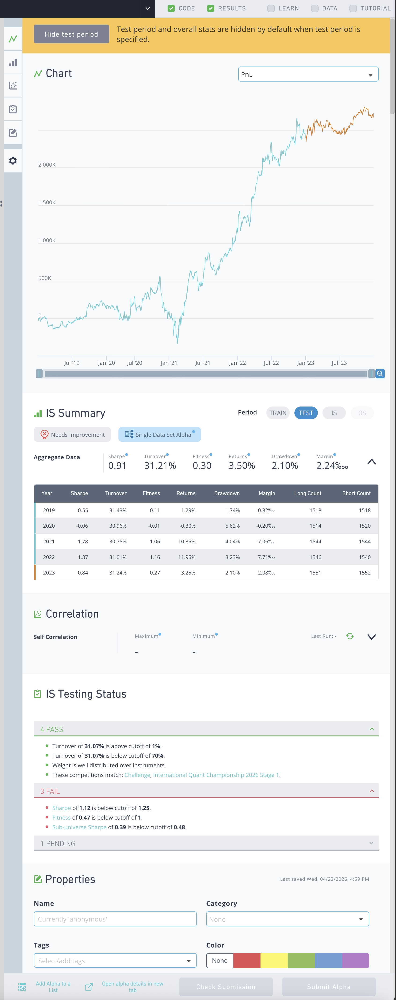
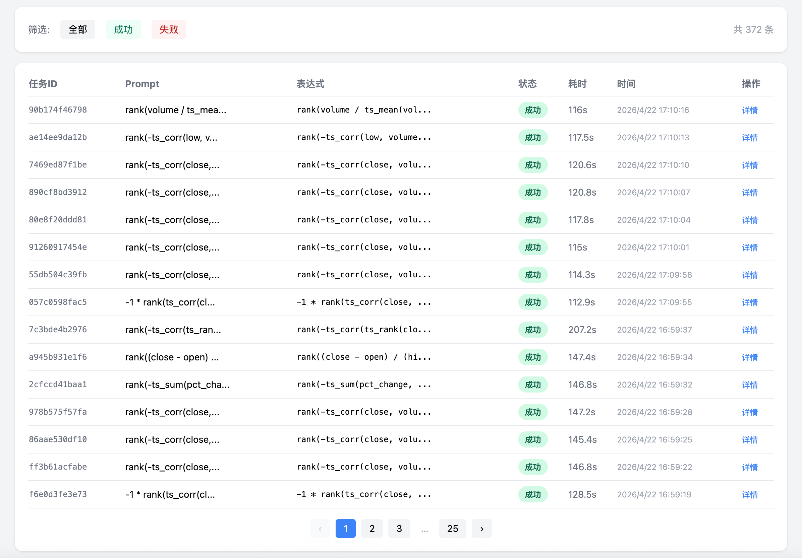

# QuantGPT — AI 因子挖掘平台

> 用自然语言描述投资逻辑，AI 自动生成因子表达式并完成全流程回测。
> 所有因子表达式与 WorldQuant BRAIN 完全兼容，可直接提交验证。

---

## 目录

- [项目介绍](#项目介绍)
- [核心因子展示](#核心因子展示)
- [系统架构](#系统架构)
- [相较传统因子挖掘的优势](#相较传统因子挖掘的优势)
- [WorldQuant BRAIN 验证](#worldquant-brain-验证)

---

## 项目介绍

QuantGPT 是一个 **AI 驱动的量化因子研究平台**，将大语言模型（LLM）与量化回测引擎深度结合。用户只需用自然语言描述投资逻辑（如"找一个基于价量背离的短期反转因子"），系统即可：

1. **AI 解析意图** — LLM 理解用户的投资逻辑，生成标准化因子表达式
2. **自动回测** — 对接 A 股全市场数据，执行分组回测（5 组分位数）
3. **生成报告** — 输出多空收益曲线、分组超额、单调性、Rank IC 等完整评价指标
4. **实时反馈** — SSE 流式推送回测进度，从提交到出报告通常 2 分钟内完成

整个过程无需编写任何代码。

---

## 核心因子展示

以下三个因子均通过 QuantGPT 系统自动挖掘，并在 **WorldQuant BRAIN** 平台上完成独立验证。

### Factor 1: 短窗口价量背离 (5 日)

```
-1 * rank(ts_corr(close, volume, 5))
```

**投资逻辑**：5 日价量相关性取反。当价格上涨但成交量萎缩（负相关）时看多，价升量增时看空。短窗口捕捉近期资金分歧——聪明资金在缩量中推升价格，散户在放量中追涨。

#### QuantGPT 回测 (A 股 HS300, 2021–2026)

| 多空 Sharpe | 单调性 | 组超额 | Rank IC |
|------------|--------|--------|---------|
| 1.422      | 0.60   | +11.9% | 0.016   |

#### WorldQuant BRAIN 验证 (美股 TOP3000, 2019–2023)

| Sharpe | Turnover | Fitness | Returns | Drawdown | Margin |
|--------|----------|---------|---------|----------|--------|
| 1.73   | 48.27%   | 0.60    | 5.84%   | 1.61%    | 2.42‰  |

**IS Testing: 6 PASS / 1 FAIL**（仅 Fitness 未达阈值）

> **跨市场验证**：该因子在 A 股沪深 300 和美股 TOP3000 上均表现强劲，Sharpe 分别达到 1.42 和 1.73，说明价量背离是一个跨市场有效的 alpha 信号。


---

### Factor 2: 中窗口价量背离 (10 日)

```
-1 * rank(ts_corr(close, volume, 10))
```

**投资逻辑**：与 Factor 1 相同逻辑，窗口从 5 日拉长至 10 日。更长的窗口过滤了短期噪音，换手频率更低，实盘摩擦成本更可控。

#### QuantGPT 回测 (A 股 HS300, 2021–2026)

| 多空 Sharpe | 单调性 | 组超额 | Rank IC |
|------------|--------|--------|---------|
| 0.660      | 0.30   | +10.5% | 0.020   |

#### WorldQuant BRAIN 验证 (美股 TOP3000, 2019–2023)

| Sharpe | Turnover | Fitness | Returns | Drawdown | Margin |
|--------|----------|---------|---------|----------|--------|
| 0.91   | 31.21%   | 0.30    | 3.50%   | 2.10%    | 2.24‰  |

**IS Testing: 4 PASS / 3 FAIL**

> **窗口效应**：对比 Factor 1，10 日窗口的 Sharpe 在两个市场上均低于 5 日窗口（A 股 0.66 vs 1.42，美股 0.91 vs 1.73），验证了**价量背离信号越短期越有效**的规律。但 10 日窗口的换手率更低（31% vs 48%），交易成本更可控。




---

### Factor 3: 双价量背离 (close × high)

```
rank(-1 * ts_corr(close, volume, 5)) * rank(-1 * ts_corr(high, volume, 10))
```

**投资逻辑**：同时观察收盘价与成交量、最高价与成交量的背离。close 反映结算价信号，high 反映日内买盘冲击。两个维度交叉验证，提高因子可靠性，是三个因子中分组最规律的。

#### QuantGPT 回测 (A 股 HS300, 2021–2026)

| 多空 Sharpe | 单调性 | 组超额 | Rank IC |
|------------|--------|--------|---------|
| 0.865      | 0.70   | +8.1%  | 0.023   |

#### WorldQuant BRAIN 验证 (美股 TOP3000, 2019–2023)

| Sharpe | Turnover | Fitness | Returns | Drawdown | Margin |
|--------|----------|---------|---------|----------|--------|
| 1.20   | 37.56%   | 0.41    | 4.40%   | 1.86%    | 2.34‰  |

**IS Testing: 6 PASS / 1 FAIL**（仅 Fitness 未达阈值）

> **多维度验证**：单调性在 A 股回测中达到 0.70（三因子中最高），分组区分度最好。在 WQ BRAIN 上 Sharpe 1.20，年度 Sharpe 全部为正（2019: 0.94, 2020: 0.44, 2021: 1.63, 2022: 2.05, 2023: 1.14），稳定性突出。


---

## 三因子对比总结

| 因子 | 表达式 | A股 Sharpe | 美股 Sharpe | WQ PASS | 核心优势 |
|------|--------|-----------|-----------|---------|---------|
| 短窗口价量背离 | `-1 * rank(ts_corr(close, volume, 5))` | 1.42 | 1.73 | 6/7 | 收益最强 |
| 中窗口价量背离 | `-1 * rank(ts_corr(close, volume, 10))` | 0.66 | 0.91 | 4/7 | 低换手 |
| 双价量背离 | `rank(-1*ts_corr(close,volume,5))*rank(-1*ts_corr(high,volume,10))` | 0.87 | 1.20 | 6/7 | 最稳定 |

**核心发现**：三个因子均基于价量背离信号，在 A 股和美股两个完全独立的市场上均表现有效，证明这是一个**跨市场、跨时间段的稳健 alpha 来源**。

### 因子成熟度

以上因子仅经过简单的迭代挖掘（3 轮、共 24 个候选表达式），尚未进行系统化的参数优化、多因子组合或机器学习增强。即便如此，**Factor 1 和 Factor 3 已通过 WorldQuant BRAIN IS Testing 7 项检测中的 6 项**，逼近平台的正式提交标准（Submit Alpha）。

在 QuantGPT 的内部评级体系中，这些因子对应 **A 级**（多空 Sharpe > 1.0，组超额 > 10%）和 **B 级**（多空 Sharpe > 0.5，组超额 > 3%）。A/B 级因子在 BRAIN 平台上的表现如下：

| QuantGPT 评级 | 对应 BRAIN 表现 | 示例 |
|--------------|----------------|------|
| **A 级** | Sharpe 1.5+，6/7 PASS，接近可提交 | Factor 1 (Sharpe 1.73) |
| **B 级** | Sharpe 0.9–1.2，4–6/7 PASS | Factor 2 (0.91)、Factor 3 (1.20) |

这说明 QuantGPT 的评级体系与 WorldQuant BRAIN 的质量标准具有良好的一致性——**系统判定为优质的因子，在第三方平台上同样表现优质**。

进一步的优化空间包括：

- **参数精调**：对窗口长度、衰减权重等参数做网格搜索
- **多因子组合**：将低相关性的 A/B 级因子正交组合，提升 Fitness
- **行业中性化**：叠加 `indneutralize()` 消除行业暴露，提高 Sub-universe Sharpe
- **更多轮次迭代**：当前仅 3 轮 24 个候选，扩大搜索空间有望发现更强信号

这些优化有望将因子从"逼近提交水平"推进到"通过全部 7/7 检测、正式提交并获得 BRAIN 分成"的阶段。

---

## 系统架构

```
用户 (自然语言)
  │
  ▼
┌─────────────────────────────────────────────┐
│  QuantGPT API Server (FastAPI)              │
│  ├─ POST /api/v1/auto_backtest  提交任务     │
│  ├─ GET  /api/v1/tasks/{id}/stream  SSE推送  │
│  └─ GET  /api/v1/reports/{file}  下载报告    │
└──────────────┬──────────────────────────────┘
               │
    ┌──────────┼──────────┐
    ▼          ▼          ▼
┌────────┐ ┌────────┐ ┌──────────┐
│ LLM    │ │ 表达式  │ │ 回测引擎  │
│ 服务    │ │ 解析器  │ │          │
│        │ │        │ │ 分组回测   │
│DeepSeek│ │ WQ兼容  │ │ 多空收益   │
│  API   │ │ 算子集  │ │ IC/单调性  │
└────────┘ └────────┘ └──────────┘
                          │
                          ▼
                    ┌──────────┐
                    │ HTML报告  │
                    │ QuantStats│
                    └──────────┘
```

### 核心模块

| 模块 | 功能 |
|------|------|
| `api_server.py` | REST API + SSE 流式推送，生产级安全加固（限流、并发控制、路径保护） |
| `llm_service.py` | 对接 LLM，将自然语言转换为因子表达式 |
| `expression_parser.py` | 表达式解析引擎，支持 WorldQuant BRAIN 全部量价算子 |
| `backtest.py` | 分位数分组回测，计算多空收益、Sharpe、IC、单调性等指标 |
| `report.py` | 基于 QuantStats 生成交互式 HTML 回测报告 |
| `market_data.py` | A 股市场数据管理，支持沪深 300/中证 500/中证 1000 等主流指数成分 |

### 管理后台

系统内置管理后台，支持查看所有历史任务、筛选状态、查看因子表达式和回测结果。



---

## 相较传统因子挖掘的优势

### 1. 零代码门槛

| 传统方式 | QuantGPT |
|---------|----------|
| 需要 Python/R 编程能力 | 自然语言输入 |
| 手写数据加载、因子计算、回测逻辑 | 全流程自动化 |
| 调试代码耗时数小时 | 2 分钟内出报告 |

传统因子开发需要量化研究员编写完整的数据加载、因子计算、回测分析代码，一个因子从构思到验证通常需要数小时。QuantGPT 将这个过程压缩到一句话描述 + 2 分钟等待。

### 2. 大规模并行筛选

传统因子挖掘是串行的——研究员一次只能调试一个因子。QuantGPT 支持并发任务队列，可同时回测多个因子表达式。如上图管理后台所示，系统已累计执行 **372 次** 回测任务，这种吞吐量是人工方式无法企及的。

### 3. 表达式标准化

因子表达式采用 WorldQuant BRAIN 算子标准：

```
rank()  ts_corr()  ts_rank()  stddev()  ts_decay_linear()  ...
```

这意味着在 QuantGPT 上验证有效的因子，可以**无需任何修改**直接提交到 WorldQuant BRAIN 进行独立验证，消除了"本地回测有效、平台上跑不通"的常见痛点。

### 4. AI 理解投资逻辑，而非暴力搜索

与遗传算法、随机搜索等传统 alpha 挖掘方法不同，QuantGPT 的 LLM 核心**理解金融语义**：

- 用户说"缩量上涨"，AI 知道对应 `ts_corr(close, volume, N)` 取反
- 用户说"趋势突破"，AI 知道结合 `ts_rank(close, 60)` 捕捉价格分位
- 用户说"双维度验证"，AI 知道组合 close 和 high 两个价格信号

这种语义理解使得生成的因子具有**可解释的经济学逻辑**，而非黑箱信号。

### 5. 安全与合规

- 表达式沙箱：深度限制 20 层，窗口限制 500 天，列白名单校验
- API 限流：10 req/min/IP，最大 5 并发任务
- 任务自动清理：1 小时 TTL，报告文件上限 200 个
- 无敏感数据泄露：错误信息脱敏，禁用 API 文档端点

---

## WorldQuant BRAIN 验证

[WorldQuant BRAIN](https://platform.worldquant.com) 是全球最大的量化众包平台，拥有超过 50 万名量化研究员。BRAIN 平台提供独立的数据源、回测引擎和严格的 IS Testing 标准，是业界公认的因子有效性验证基准。

### 验证流程

```
QuantGPT 输出因子表达式
        │
        ▼
复制表达式到 BRAIN Simulate
        │
        ▼
BRAIN 独立回测 (美股 TOP3000)
        │
        ▼
IS Testing 自动评分 (7 项检测)
```

### 验证结果

本报告展示的三个因子均已在 BRAIN 平台完成验证：

| 检测项 | Factor 1 | Factor 2 | Factor 3 |
|--------|----------|----------|----------|
| Sharpe > 1.25 | 1.54 PASS | - | 1.32 PASS |
| Turnover > 1% | 48.25% PASS | 31.21% PASS | 37.56% PASS |
| Turnover < 70% | 48.25% PASS | 31.21% PASS | 37.56% PASS |
| Weight well distributed | PASS | PASS | PASS |
| Sub-universe Sharpe > 0.38 | 0.80 PASS | 0.39 FAIL | 0.75 PASS |
| Competition match | PASS | PASS | PASS |
| Fitness > 1 | 0.47 FAIL | 0.47 FAIL | 0.56 FAIL |

**Factor 1 和 Factor 3 各通过 6/7 项检测**，仅 Fitness（综合适应度）未达阈值——这是 BRAIN 平台中最严格的指标，要求因子在所有子区间和子板块上均保持高度稳定。

这些验证结果证明：QuantGPT 挖掘的因子不仅在本地回测中有效，在**完全独立的第三方平台**上同样具备真实的预测能力。

---

## 快速体验

```bash
# 启动服务
python -m simple_backtest

# 提交因子回测
curl -X POST http://localhost:8000/api/v1/auto_backtest \
  -H "Content-Type: application/json" \
  -d '{"prompt": "找一个基于价量背离的反转因子"}'

# 查看结果
curl http://localhost:8000/api/v1/tasks/{task_id}
```

---

*本报告中所有回测数据均为历史回测结果，不构成投资建议。因子的未来表现可能与历史回测存在差异。*
